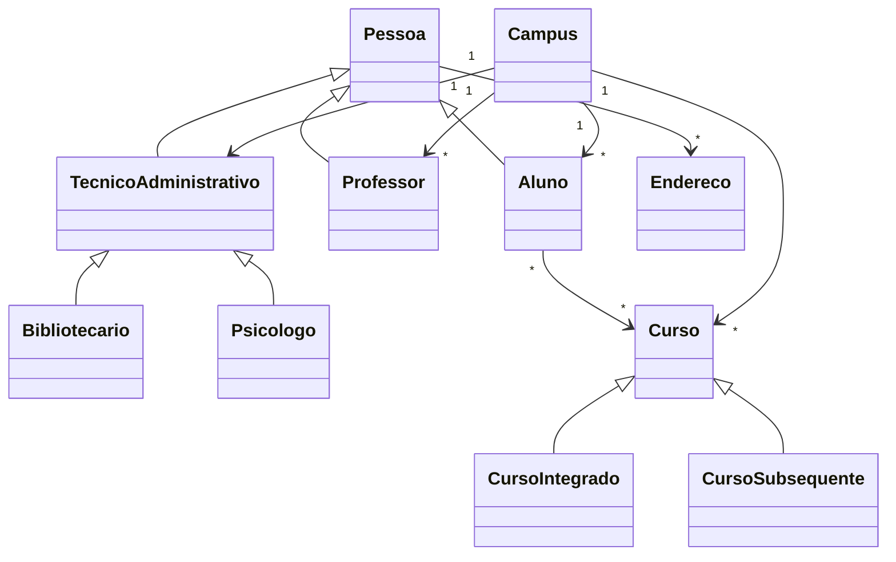

<div align="center">

# ☕ Programação Orientada a Objetos com Java

Reimplementação em Java de um projeto acadêmico originalmente desenvolvido em TypeScript, utilizando o mesmo domínio educacional para comparar conceitos, recursos e diferenças entre as linguagens.


</div>

---

## 📌 Sobre o projeto

Este projeto foi desenvolvido para praticar os principais conceitos da Programação Orientada a Objetos utilizando Java.

A aplicação é uma releitura do projeto:

[Programação Orientada a Objetos com TypeScript](https://github.com/ONestoDev/poo-typescript)

A proposta foi manter o mesmo domínio acadêmico e reimplementar sua modelagem utilizando recursos próprios do ecossistema Java, como:

* classes abstratas;
* interfaces;
* herança;
* polimorfismo;
* encapsulamento;
* pacotes;
* listas tipadas;
* compilação com JDK;
* execução pela JVM.

O sistema funciona inteiramente em memória e possui finalidade educacional.

---

## 🎯 Objetivos

Os principais objetivos do projeto são:

* praticar Programação Orientada a Objetos;
* comparar Java e TypeScript;
* modelar entidades de um domínio acadêmico;
* aplicar herança e abstração;
* utilizar interfaces;
* organizar classes em pacotes;
* trabalhar com coleções;
* compreender compilação e execução em Java;
* registrar a evolução técnica entre linguagens.

---

## 🧠 Domínio modelado

O projeto representa uma instituição de ensino simplificada.

### Pessoa

Classe base para entidades que representam pessoas.

Especializações:

* aluno;
* professor;
* técnico administrativo.

### Aluno

Representa um estudante associado a cursos e endereços.

### Professor

Representa um professor vinculado a um campus.

### Técnico administrativo

Classe abstrata utilizada como base para funcionários administrativos.

Especializações:

* bibliotecário;
* psicólogo.

### Curso

Classe abstrata utilizada para representar diferentes modalidades.

Especializações:

* curso integrado;
* curso subsequente.

### Campus

Representa uma unidade acadêmica responsável por agrupar:

* alunos;
* professores;
* cursos;
* técnicos administrativos;
* endereço.

### Endereço

Representa as informações de localização utilizadas pelas demais entidades.

### Projeto

Interface utilizada para definir contratos comuns entre determinadas classes.

---

## 🧩 Conceitos de POO aplicados

### Classes e objetos

Cada elemento do domínio é representado por uma classe.

```java
CursoSubsequente curso = new CursoSubsequente(
    "Informática",
    1200,
    true
);
```

### Encapsulamento

Os atributos são privados e acessados por métodos públicos.

```java
private String nome;

public String getNome() {
    return nome;
}

public void setNome(String nome) {
    this.nome = nome;
}
```

### Herança

```text
Pessoa
├── Aluno
├── Professor
└── TecnicoAdministrativo
    ├── Bibliotecario
    └── Psicologo
```

Também existe herança entre cursos:

```text
Curso
├── CursoIntegrado
└── CursoSubsequente
```

### Abstração

Classes abstratas representam conceitos gerais que não devem ser instanciados diretamente.

Exemplos:

* `Pessoa`;
* `Curso`;
* `TecnicoAdministrativo`.

### Interfaces

A interface `Projeto` define comportamentos que podem ser implementados por classes do domínio.

### Associação

Objetos mantêm referências a outras entidades.

Exemplos:

* professor associado a um campus;
* aluno associado a cursos;
* pessoa associada a endereços.

### Agregação

O campus agrupa professores, alunos, cursos e técnicos administrativos.

Esses objetos podem existir independentemente do campus.

### Polimorfismo

Subclasses podem ser tratadas por seus tipos mais gerais.

Exemplo:

```java
List<Curso> cursos = List.of(
    new CursoIntegrado("Eletrotécnica", 3200, true),
    new CursoSubsequente("Informática", 1200, true)
);
```

---

## 🔄 Relacionamentos principais



---

## 📁 Estrutura do projeto

```text
Projeto-poo-typescript-Feito-em-Java/
│
├── poo-typescript/
│   ├── src/
│   │   ├── Aluno/
│   │   │   └── Aluno.java
│   │   ├── Campus/
│   │   │   └── Campus.java
│   │   ├── Curso/
│   │   │   ├── Curso.java
│   │   │   ├── CursoIntegrado.java
│   │   │   └── CursoSubsequente.java
│   │   ├── Endereco/
│   │   │   └── Endereco.java
│   │   ├── Pessoa/
│   │   │   └── Pessoa.java
│   │   ├── Professor/
│   │   │   └── Professor.java
│   │   ├── Projeto/
│   │   │   └── Projeto.java
│   │   ├── TecnicoAdministrativo/
│   │   │   ├── TecnicoAdministrativo.java
│   │   │   ├── Bibliotecario.java
│   │   │   └── Psicologo.java
│   │   └── Main.java
│   └── out/
│
└── README.md
```

---

## 🛠️ Tecnologias

| Tecnologia    | Aplicação                   |
| ------------- | --------------------------- |
| Java          | Linguagem principal         |
| JDK 21        | Compilação e execução       |
| IntelliJ IDEA | Ambiente de desenvolvimento |
| Git           | Controle de versão          |
| GitHub        | Hospedagem e documentação   |

O projeto não utiliza bibliotecas externas.

---

## 🚀 Como executar

### Pré-requisitos

É necessário possuir:

* JDK 21 ou superior;
* Git;
* terminal ou uma IDE Java.

Verifique a instalação:

```bash
java --version
```

```bash
javac --version
```

### Clone o repositório

```bash
git clone https://github.com/ONestoDev/Projeto-poo-typescript-Feito-em-Java.git
```

### Acesse o projeto

```bash
cd Projeto-poo-typescript-Feito-em-Java/poo-typescript
```

### Compile no Linux ou macOS

```bash
javac -d out $(find src -name "*.java")
```

### Compile no PowerShell

```powershell
javac -d out (Get-ChildItem -Recurse -Filter *.java -Path src | ForEach-Object { $_.FullName })
```

### Execute

```bash
java -cp out Main
```

---

## 🧪 Exemplo de execução

O programa principal cria:

* dois endereços;
* três cursos;
* um campus;
* um professor;
* um bibliotecário;
* um psicólogo.

Depois, as entidades são associadas ao campus e exibidas no terminal.

Exemplo aproximado:

```text
Professor{matricula=89409093, nome='Luis Gomes', salario=5000.0}
Campus{nome='Campus Aracaju', quantidadeAlunos=0}
Bibliotecario{nome='Ana Souza', setor='Biblioteca'}
Psicologo{nome='Carlos Lima', areaAtuacao='Atendimento estudantil'}
----------------------------------
3
```

Os números de matrícula podem variar porque são gerados automaticamente.

---

## 🆚 Comparação com TypeScript

| Aspecto           | TypeScript                 | Java               |
| ----------------- | -------------------------- | ------------------ |
| Execução          | Node.js                    | JVM                |
| Compilação        | TypeScript para JavaScript | Java para bytecode |
| Gerenciamento     | npm                        | JDK                |
| Organização       | Módulos                    | Pacotes            |
| Tipagem           | Estática sobre JavaScript  | Estática nativa    |
| Classe base       | Classes e abstrações       | Classes abstratas  |
| Contratos         | Interfaces TypeScript      | Interfaces Java    |
| Arquivo principal | `index.ts`                 | `Main.java`        |

Apesar das diferenças, os dois projetos trabalham os mesmos fundamentos:

* modelagem;
* responsabilidades;
* encapsulamento;
* reutilização;
* relacionamentos entre objetos.

---

## ✅ Pontos fortes

O projeto demonstra:

* reimplementação de um mesmo domínio em duas linguagens;
* uso de classes abstratas;
* uso de interfaces;
* herança;
* polimorfismo;
* listas tipadas;
* separação por responsabilidade;
* organização em pacotes;
* métodos de inclusão em coleções;
* sobrescrita de `toString`;
* compilação manual com JDK.

---

## ⚠️ Limitações atuais

O projeto ainda possui algumas limitações:

* não possui testes automatizados;
* não possui persistência;
* não possui interface gráfica;
* não possui banco de dados;
* não possui validações robustas;
* os pacotes utilizam nomes iniciados com letras maiúsculas;
* os arquivos compilados podem estar versionados;
* o projeto está dentro de uma pasta interna com nome do projeto original;
* não utiliza Maven ou Gradle;
* os dados de exemplo estão diretamente no `Main`.

---

## 🗺️ Melhorias futuras

* normalizar pacotes para letras minúsculas;
* mover o projeto para a raiz do repositório;
* remover a pasta `out` do versionamento;
* adicionar `.gitignore`;
* criar testes com JUnit;
* adicionar Maven ou Gradle;
* validar dados de entrada;
* criar enums para situações fixas;
* impedir cadastros duplicados;
* adicionar métodos de remoção;
* separar dados de demonstração;
* melhorar as regras de negócio;
* documentar diferenças entre Java e TypeScript.

---

## 🧪 Testes recomendados

| Cenário                | Resultado esperado    |
| ---------------------- | --------------------- |
| Criar campus válido    | Campus criado         |
| Adicionar professor    | Professor incluído    |
| Adicionar aluno        | Quantidade atualizada |
| Adicionar curso        | Curso incluído        |
| Nome vazio             | Entrada rejeitada     |
| Carga horária negativa | Entrada rejeitada     |
| Salário negativo       | Entrada rejeitada     |
| Objeto duplicado       | Inclusão rejeitada    |

---

## 📚 Aprendizados desenvolvidos

Durante o projeto foram praticados:

* Java;
* orientação a objetos;
* classes;
* objetos;
* encapsulamento;
* herança;
* abstração;
* interfaces;
* polimorfismo;
* composição;
* agregação;
* associação;
* coleções;
* pacotes;
* compilação;
* JVM.

---

## 🎓 Contexto educacional

Este projeto foi desenvolvido como exercício de comparação entre uma implementação em TypeScript e sua reescrita em Java.

A proposta não é construir um sistema acadêmico completo, mas compreender como a mesma modelagem pode ser adaptada entre diferentes linguagens.

---

## 👨‍💻 Autor

Desenvolvido por **Ernesto — ONestoDev**.

[](https://github.com/ONestoDev)

---

## 📄 Licença

O projeto pretende utilizar a licença MIT.

Adicione um arquivo `LICENSE` na raiz do repositório para formalizar as condições de uso, modificação e distribuição.
